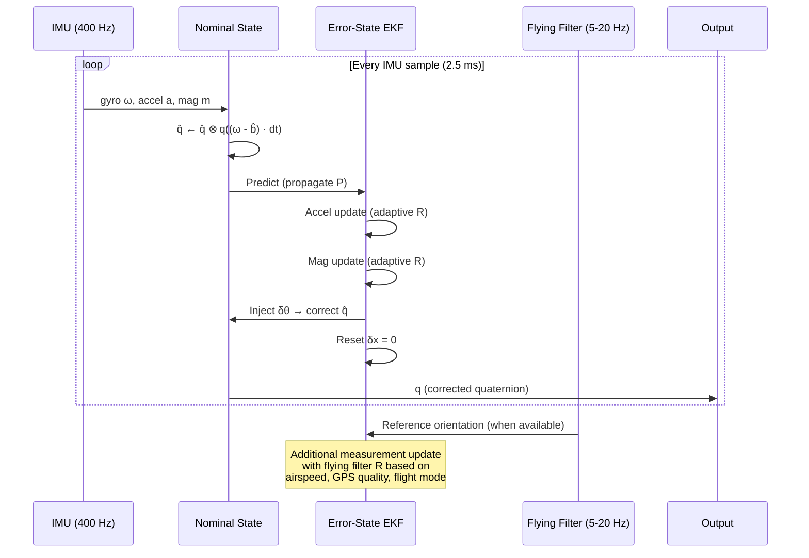

# Error-State EKF Sensor Fusion — Design Document

> Replacing/augmenting Madgwick AHRS with a proper EKF for FlySight 2 head orientation.
> Living document — updated with code. Last revised: 2026-04-01.

---

## Table of Contents

1. [Motivation — Why Replace Madgwick](#1-motivation--why-replace-madgwick)
2. [Algorithm Selection](#2-algorithm-selection)
3. [Error-State EKF Architecture](#3-error-state-ekf-architecture)
4. [State Vector & Dynamics](#4-state-vector--dynamics)
5. [Measurement Models](#5-measurement-models)
6. [External Reference Integration](#6-external-reference-integration--the-flying-filter)
7. [Lever Arms & Multi-Device Geometry](#7-lever-arms--multi-device-geometry)
8. [Adaptive Noise — Continuous Rejection](#8-adaptive-noise--continuous-rejection)
9. [Filter Lifecycle & Timing](#9-filter-lifecycle--timing)
10. [Flight Controller Orchestration](#10-flight-controller-orchestration)
11. [Sensor Configurations & Runtime Modes](#11-sensor-configurations--runtime-modes)
12. [Implementation Plan](#12-implementation-plan)
13. [Calibration Interface](#13-calibration-interface)
14. [Reference Material](#14-reference-material)
15. [Open Questions](#15-open-questions)

---

## 1. Motivation — Why Replace Madgwick

The Madgwick algorithm (revised version, Ch.7 of his PhD thesis) is a complementary filter that integrates gyro and applies a gradient descent correction from accelerometer and magnetometer. It works well for simple orientation tracking in benign conditions. In our application — wingsuit BASE / skydiving with dynamic acceleration, magnetic distortion near aircraft, and the need for GPS-fused heading — it falls short in specific, important ways:

### Problems Observed (2026-03-31 testing session)

1. **Binary rejection is too coarse.** Acceleration and magnetic rejection are threshold-based: trust the sensor fully or ignore it entirely. There's no middle ground. During sustained dynamic flight (2-3g turns, body accelerations), the filter oscillates between trusting and ignoring the accelerometer, causing visible wobble.

2. **Heading is the weakest axis.** The magnetometer provides the only heading reference. When it's rejected (magnetic distortion near aircraft, soft iron from helmet hardware), heading drifts at the gyro bias rate with no recovery mechanism except the magnetometer itself coming back. The recovery dynamics are unpredictable.

3. **No uncertainty awareness.** The algorithm outputs a quaternion with no confidence information. There's no way to know "pitch is good but heading is uncertain." Every axis has the same single gain β.

4. **No external reference injection.** We have high-quality heading/pitch/roll estimates from our GPS-based flying filter (SG pipeline + orientation EKF with full aerodynamic model). There's no principled way to feed that information into the Madgwick algorithm. The only workaround discovered was dynamically adjusting calibration offsets — a hack that works but has no theoretical basis.

5. **No gyro bias estimation.** Madgwick integrates gyro measurements at face value (optionally with a separate bias estimator). Temperature-dependent bias drift accumulates during dissociation periods when the correction term is suppressed.

### What We Need

- **Continuous sensor weighting** instead of binary accept/reject
- **External reference vectors** from the flying filter (heading, pitch, roll) as first-class measurements with tunable confidence
- **Per-axis uncertainty** — know when heading is good vs drifting
- **Gyro bias tracking** — prevent drift during dynamic periods
- **Same output format** — quaternion at sensor rate (400 Hz), exportable as fused CSV

---

## 2. Algorithm Selection

### Candidates Evaluated

| Algorithm | Type | Strengths | Weaknesses | Verdict |
|-----------|------|-----------|------------|---------|
| **Madgwick** (current) | Complementary | Fast, simple, well-tested | Binary rejection, no uncertainty, no bias, no external refs | Replace |
| **Mahony** | Complementary (PI controller) | Faster convergence than Madgwick, integral term tracks bias | Still complementary — same fundamental limitations | Not enough improvement |
| **Direct Quaternion EKF** (4-7 state) | EKF on quaternion directly | Proper covariance, external refs possible | Quaternion normalization issues, linearization around large errors less accurate | Good but not ideal |
| **Error-State Quaternion EKF** | EKF on error perturbation | Best linearization (error always small), clean injection, no normalization issues, standard in industry | More conceptually complex, two-layer architecture | **Selected** |
| **UKF** (Unscented) | Sigma-point filter | No Jacobians needed, better for high nonlinearity | More expensive (~2N+1 sigma points per step), overkill for quaternion kinematics which are mildly nonlinear | Overkill |
| **Madgwick → EKF chain** | Two-stage | Reuses existing Madgwick, EKF refines | Madgwick output IS the nominal state in error-state formulation — just skip the middleman | Absorbed into error-state approach |

### Selection: Error-State Quaternion EKF (Solà formulation)

The error-state approach is the industry standard for INS/AHRS (used in VectorNav, Xsens, PX4 autopilot). It separates the problem into:

1. **Nominal state** — integrated forward using gyro (fast, every sample, no filter overhead)
2. **Error state** — small perturbation tracked by EKF (only updated when measurements arrive)

The key insight: the error is always small (because it's reset after each correction), so linearization is always accurate. This avoids the main failure mode of direct quaternion EKFs where large errors make the Jacobian approximation poor.

---

## 3. Error-State EKF Architecture

```
┌─────────────────────────────────────────────────────────┐
│                    NOMINAL STATE                         │
│   (runs at IMU rate: 400 Hz, no filter overhead)        │
│                                                          │
│   q̂ ← q̂ ⊗ q((ω_gyro - b̂_gyro) · dt)                   │
│                                                          │
│   This is just gyro integration. Fast. Always runs.     │
└────────────────────────┬────────────────────────────────┘
                         │ q̂ (nominal quaternion)
                         │
┌────────────────────────▼────────────────────────────────┐
│                    ERROR-STATE EKF                        │
│   (runs at measurement rate: variable)                   │
│                                                          │
│   State: δx = [δθ(3), δb_gyro(3), δb_mag(3)]           │
│   Covariance: P (9×9)                                    │
│                                                          │
│   PREDICT: propagate error covariance                    │
│     δx̂ = F · δx  (F from gyro dynamics)                 │
│     P̂ = F·P·Fᵀ + Q                                     │
│                                                          │
│   UPDATE (when measurements arrive):                     │
│     Innovation: y = z_meas - h(q̂)                       │
│     Kalman gain: K = P̂·Hᵀ·(H·P̂·Hᵀ + R)⁻¹              │
│     Error correction: δx = K · y                        │
│     Covariance: P = (I - K·H) · P̂                      │
│                                                          │
│   INJECT: apply correction to nominal state              │
│     q ← q̂ ⊗ q(δθ)   (small rotation from error)       │
│     b_gyro ← b̂_gyro + δb_gyro                           │
│     b_mag ← b̂_mag + δb_mag                              │
│     δx ← 0   (reset error state)                        │
│     P ← G·P·Gᵀ  (reset covariance rotation)            │
└─────────────────────────────────────────────────────────┘
```

### Why Two Layers?

The nominal state handles the high-rate gyro integration (400 Hz) with zero overhead — just quaternion multiplication. The EKF only runs when measurements arrive (could be every sample for accel/mag, or every 50-200ms for flying filter references). This separation means:

- IMU processing is always fast regardless of how many measurement sources exist
- Adding a new measurement source (GPS heading, flying filter, barometer) doesn't slow down the core integration
- The error is always near zero → Jacobians are always accurate

---

## 4. State Vector & Dynamics

### Error State (9 elements)

| Index | Symbol | Units | Description |
|-------|--------|-------|-------------|
| 0-2 | δθ | rad | Rotation error (axis-angle, small) |
| 3-5 | δb_gyro | rad/s | Gyroscope bias error |
| 6-8 | δb_mag | µT | Magnetometer bias/distortion error |

### Nominal State (maintained separately, not in EKF)

| Symbol | Type | Description |
|--------|------|-------------|
| q̂ | quaternion | Orientation (integrated from gyro) |
| b̂_gyro | 3-vector | Current gyro bias estimate (rad/s) |
| b̂_mag | 3-vector | Current mag bias estimate (µT) |

### State Transition (Continuous)

The error-state dynamics (Solà §5.3.3):

```
δθ̇ = -[ω×] δθ - δb_gyro + n_θ
δḃ_gyro = n_b_gyro      (random walk)
δḃ_mag = n_b_mag         (random walk)
```

Where `[ω×]` is the skew-symmetric matrix of the gyro measurement (minus bias), and `n` terms are process noise.

### Discrete State Transition Matrix F (9×9)

```
F = | R(ω·dt)ᵀ   -I·dt    0    |
    |    0          I      0    |
    |    0          0      I    |
```

Where `R(ω·dt)` is the rotation matrix corresponding to the gyro-integrated rotation over dt. For small dt (2.5ms at 400 Hz), the first-order approximation `I - [ω×]·dt` is sufficient.

### Process Noise Q (9×9, diagonal)

| States | Symbol | Typical Value | Physical Meaning |
|--------|--------|---------------|------------------|
| δθ | σ²_θ | (0.01 rad/s · √dt)² | Gyro white noise |
| δb_gyro | σ²_bg | (0.001 rad/s² · dt)² | Gyro bias instability (random walk) |
| δb_mag | σ²_bm | (0.1 µT/s · dt)² | Mag environment change rate |

These need tuning from FlySight sensor datasheets:
- **LSM6DSO gyro**: noise density 3.8 mdps/√Hz → σ_θ ≈ 6.6e-5 rad/√s
- **LSM6DSO gyro bias**: in-run stability ~5°/hr → σ_bg ≈ 2.4e-5 rad/s/√s
- **LIS2MDL mag**: noise density 3 mGauss/√Hz → σ for mag measurements

---

## 5. Measurement Models

Each measurement compares a predicted value h(q̂) against the actual sensor reading. The innovation (residual) drives the correction.

### 5.1 Accelerometer (Gravity Direction)

**When to use:** Every IMU sample (400 Hz), with adaptive R based on acceleration magnitude.

**Model:** The accelerometer measures gravity in body frame (plus linear acceleration noise):

```
z_accel = R(q̂)ᵀ · [0, 0, g]ᵀ + noise

h(q̂) = R(q̂)ᵀ · g_ref      (predicted gravity direction in body frame)
```

**Jacobian H_accel** (3×9): derivative of h w.r.t. error state δθ:

```
H_accel = [ [R(q̂)ᵀ · g_ref ×]   0₃ₓ₃   0₃ₓ₃ ]
```

Where `[v×]` is the skew-symmetric matrix of vector v.

**Measurement noise R_accel:**
- Base value from sensor datasheet
- **Scaled up** when `||a_measured|| - g` is large (dynamic acceleration detected)
- This replaces Madgwick's binary acceleration rejection with continuous trust scaling

```
R_accel = R_accel_base · (1 + k_accel · ||a_meas - g_expected||²)
```

### 5.2 Magnetometer (Heading Direction)

**When to use:** Every mag sample (up to 400 Hz on LIS2MDL), with adaptive R based on field magnitude deviation.

**Model:** The magnetometer measures Earth's magnetic field in body frame:

```
z_mag = R(q̂)ᵀ · m_ref + b_mag + noise

h(q̂) = R(q̂)ᵀ · m_ref + b̂_mag
```

Where `m_ref` is the expected magnetic field in NED frame (from WMM/IGRF model or measured during calibration).

**Jacobian H_mag** (3×9):

```
H_mag = [ [R(q̂)ᵀ · m_ref ×]   0₃ₓ₃   I₃ₓ₃ ]
```

The `I₃ₓ₃` in the last block means the EKF can estimate magnetometer bias in real time — this is the continuous version of the hard/soft iron calibration we do offline.

**Measurement noise R_mag:**
- Base value from sensor datasheet  
- **Scaled up** when `||m_measured|| - ||m_expected||` is large (magnetic distortion detected)
- This replaces Madgwick's binary magnetic rejection

```
R_mag = R_mag_base · (1 + k_mag · (||m_meas|| - ||m_ref||)² / ||m_ref||²)
```

### 5.3 Heading-Only Magnetometer Update (Optional)

Sometimes we only want the magnetometer to correct heading, not pitch/roll (since gravity already handles those better). This uses a scalar measurement:

```
z_heading = atan2(m_N_horizontal, m_E_horizontal)
h_heading = predicted heading from q̂ + m_ref
```

This 1×9 measurement model is simpler and avoids the mag corrupting pitch/roll during distortions.

---

## 6. External Reference Integration — The Flying Filter

**This is the key architectural advantage over Madgwick.**

Our polar-visualizer orientation EKF produces heading/pitch/roll from GPS + aerodynamic model at 5-20 Hz. These are high-quality, independent estimates based on completely different sensors (GPS vs IMU). They can be injected as measurements into the sensor fusion EKF.

### 6.1 Euler Angle Reference Measurements

When the flying filter produces an orientation estimate:

```
z_ref = [φ_flying, θ_flying, ψ_flying]     (roll, pitch, heading from GPS/aero model)
h_ref = euler_angles(q̂)                     (predicted Euler angles from nominal quaternion)
```

**Jacobian H_ref** (3×9): derivative of Euler extraction w.r.t. δθ:

```
H_ref = [ J_euler(q̂)   0₃ₓ₃   0₃ₓ₃ ]
```

Where `J_euler` is the 3×3 Jacobian of the Euler angle extraction from the quaternion, evaluated at q̂.

**Measurement noise R_ref** (3×3, diagonal — per-axis confidence):

| Axis | R value | Depends on |
|------|---------|------------|
| Roll (φ) | R_roll | Airspeed — poor at low V, good at high V |
| Pitch (θ) | R_pitch | α confidence — good in steady flight, poor during transition |
| Heading (ψ) | R_heading | GPS quality (HDOP), airspeed, track stability |

```
R_ref = diag(σ²_roll(V), σ²_pitch(V, α_conf), σ²_heading(HDOP, V))
```

### 6.2 Reference Vector Measurement (Alternative)

Instead of Euler angles, inject the flying filter's orientation as a reference direction vector (e.g., body-X should point in the direction of flight):

```
z_flight_dir = R(q̂_flying) · [1, 0, 0]ᵀ      (forward direction from flying filter)
h_flight_dir = R(q̂_sensor) · [1, 0, 0]ᵀ       (forward direction from sensor quaternion)
```

This avoids Euler angle singularities and wrapping issues. The measurement is a 3-vector comparison in the inertial frame.

### 6.3 When to Trust the Flying Filter

The flying filter is only useful when the vehicle is actually flying:

| Flight Mode | Flying Filter Trust | Reason |
|-------------|-------------------|--------|
| GROUND | **None** — don't inject | No airspeed → no aero model → garbage orientation |
| FREEFALL | **Low** | Drag-only, poor heading/roll observability |
| WINGSUIT | **High** | Full aero model, good α/β estimation |
| CANOPY | **High** | Good aero model, different vehicle polar |

R_ref should be set to infinity (= ignore measurement) on the ground and during freefall, and tightened during stable wingsuit/canopy flight.

---

## 7. Lever Arms & Multi-Device Geometry

### 7.1 The Lever Arm Problem

An accelerometer measures the total specific force at its physical location, not at the body's center of rotation. For a sensor at position **r** from the center of rotation:

```
a_sensed = a_CR + ω̇ × r + ω × (ω × r) + gravity
                  ╰─────╯   ╰───────────╯
                  tangential   centripetal
```

**Gyroscopes are immune** — angular rate is identical everywhere on a rigid body. **Magnetometers are immune** — Earth's field is uniform over centimeter-scale distances. Only accelerometers see lever arm contamination.

### 7.2 Does PCB-Level Sensor Spacing Matter?

On the FlySight 2 PCB:
- **LSM6DSO** (accel + gyro) — front of PCB
- **LIS2MDL** (mag) — back of PCB, ~15mm lateral offset, ~1.6mm through-board

The accel and gyro share the same die on the LSM6DSO — their offset is effectively zero (~1mm). The magnetometer is offset but isn't affected by lever arms. So:

**Worst case (violent head shake, ω = 10 rad/s, ω̇ = 100 rad/s²):**

| Lever arm | Distance | Centripetal (ω²r) | Tangential (ω̇r) |
|-----------|----------|-------------------|------------------|
| Accel-to-gyro (same die) | ~1mm | 0.1 m/s² = 0.01g | 0.1 m/s² |
| Accel-to-mag (across PCB) | ~15mm | 1.5 m/s² = 0.15g | 1.5 m/s² |

The accel-to-gyro offset is negligible. The accel-to-mag offset is measurable during extreme rotation but irrelevant — the mag measurement model doesn't use acceleration.

**PCB-level verdict: Don't model it.** Accel and gyro are colocated. Mag doesn't care.

### 7.3 Lever Arms That DO Matter

The meaningful lever arms are in the mounting chain from sensor to flight path:

```
Sensor (on PCB)
  │  ~10cm
  ▼
Head center of rotation (atlas vertebra / neck pivot)
  │  ~50cm
  ▼
Pilot center of gravity (belly/lower torso)
  │  ~0m (in freefall, CG IS the flight path)
  ▼
Flight path
```

| Lever Arm | Distance | Typical ω | Centripetal | Effect on Accel |
|-----------|----------|-----------|-------------|-----------------|
| **Device → head CG** | ~10cm | Head turn: 3-5 rad/s | 0.9-2.5 m/s² | **0.1-0.25g** — significant |
| **Head CG → pilot CG** | ~50cm | Body rotation: 1-3 rad/s | 0.5-4.5 m/s² | **0.05-0.45g** — significant |
| **Device → pilot CG** (total) | ~60cm | Body + head: 2-5 rad/s | 2.4-15 m/s² | **0.25-1.5g** — dominant error source |

At 0.25-1.5g of contamination, the head-mounted accelerometer is measuring something quite different from the true CG acceleration during any rotational dynamics. This is **the same order of magnitude as the adaptive R threshold** — it directly affects when the filter trusts vs distrusts the accelerometer.

### 7.4 Multi-Device Architecture

Multiple devices at known positions turn the lever arm problem into an advantage:

```
┌──────────────┐         ┌──────────────┐         ┌──────────────┐
│  HEAD DEVICE │         │   CG DEVICE  │         │ CANOPY DEVICE│
│  (FlySight)  │         │  (belly/back)│         │ (bridle pt)  │
│              │         │              │         │              │
│  r_head from │         │  r_cg ≈ 0    │         │  r_canopy    │
│  pilot CG    │         │  (at CG)     │         │  from pilot  │
│              │         │              │         │  (tether)    │
│  Sees:       │         │  Sees:       │         │  Sees:       │
│  a_CG + lever│         │  a_CG (clean)│         │  canopy aero │
│  + head rot  │         │  + body rot  │         │  + coupling  │
└──────┬───────┘         └──────┬───────┘         └──────┬───────┘
       │                        │                        │
       └────────────┬───────────┘                        │
                    ▼                                     │
            ┌───────────────┐                             │
            │  Pilot Sensor │◄────────────────────────────┘
            │  Fusion EKF   │
            └───────┬───────┘
                    │
                    ▼
            ┌───────────────┐
            │Flying Filter  │
            │(GPS + aero)   │
            └───────────────┘
```

**CG device** is the cleanest accelerometer source — minimal lever arm contamination. It directly measures what the flying filter needs (CG acceleration). Even a cheap second FlySight in a belly pocket dramatically improves accel measurement quality.

**Head device** is best for high-rate orientation tracking (head pointing, gaze direction) but its accelerometer is contaminated by head motion relative to body.

**Canopy device** measures canopy orientation independently of pilot body — valuable under canopy where pilot swings relative to wing. Not useful in wingsuit/freefall.

### 7.5 Lever Arm Compensation in the EKF

For each device i with known offset **r_i** from pilot CG, the accelerometer measurement model becomes:

```
h_accel_i(q_i, ω, ω̇) = R(q_i)ᵀ · [a_CG + ω̇ × r_i + ω × (ω × r_i) + g]
```

The Jacobian H_accel now includes partial derivatives w.r.t. angular rate ω (from the lever arm terms). If the filter estimates ω (it does — from gyro), the lever arm contribution can be **predicted and subtracted**.

#### Simple Approach: Subtract and Ignore

If we know r_i and have a gyro estimate of ω:

```
a_corrected = a_measured - R(q) · [ω̇ × r_i + ω × (ω × r_i)]
```

Then use `a_corrected` in the standard (no lever arm) measurement model. This works well when ω is well-known (it is — gyro is our best sensor). The ω̇ term requires differentiating the gyro signal (noisy) or using the angular acceleration state if we expand the filter.

#### Full Approach: Include in Measurement Model

Keep the lever arm terms in h() and let the EKF handle it through the Jacobian. More correct but more complex. Worth it for the head device (large r, fast head rotation) but probably overkill for CG device (small r).

#### Practical Note: ω̇ Estimation

The tangential term ω̇ × r requires angular acceleration, which we don't directly measure. Options:

1. **Finite difference of gyro**: ω̇ ≈ (ω_k - ω_{k-1}) / dt — noisy but adequate for small r
2. **State augmentation**: Add ω̇ to the EKF state — heavier but smoother
3. **Ignore ω̇ term**: For moderate rotation rates and small lever arms, the centripetal term dominates. ω̇ × r is large only during transient rotation changes (head snap, exit). Can be absorbed into adaptive R.

**Recommendation:** For the head device (r ≈ 0.1m), use the simple subtraction approach with centripetal only (ignore ω̇). For the CG device (r ≈ 0), no compensation needed. Revisit if residuals show systematic bias during rotation.

### 7.6 Mounting Offset Calibration

Each device needs a known position vector r_i relative to pilot CG:

| Device | Position (NED, relative to CG) | How to Measure |
|--------|-------------------------------|----------------|
| Head FlySight | r ≈ [−0.15, 0, −0.55] m | Measure neck-to-helmet offset, CG at belly button |
| CG device (belly) | r ≈ [0, 0, 0] m | By definition (placed at CG) |
| CG device (lower back) | r ≈ [0.10, 0, 0.05] m | Measure from belly button to back pocket |
| Canopy bridle | r ≈ [−0.2, 0, −2.0] m | Depends on line length + attachment |

These are approximate and pilot-specific. Could be measured once per rig setup. For initial implementation, the CG device assumption of r ≈ 0 is the important one — it means no compensation needed for the cleanest accel source.

### 7.7 Rigid Body Assumption & Limits

All lever arm math assumes the pilot + device is a **rigid body**. This breaks down when:

- **Head moves relative to body** — head nod/turn makes r_head time-varying. For the error-state EKF, this appears as additional process noise on the head device's accelerometer. Handle with higher R_accel for the head device.
- **Canopy moves relative to pilot** — canopy and pilot are connected by flexible lines. The canopy device is on a separate rigid body entirely. Needs its own orientation state (separate filter or separate state in a larger filter).
- **Arms/legs move** — in wingsuit, arm sweep changes both CG position and body inertia. Small effect compared to head/canopy issues.

For the pilot body (CG device), the rigid body assumption holds well in wingsuit flight (suit constrains limb positions). For the head, treat the device-to-CG offset as **approximate** and let the adaptive R absorb the residual.

---

## 8. Adaptive Noise — Continuous Rejection

The biggest improvement over Madgwick: instead of binary accept/reject, the EKF uses **continuous R scaling** to modulate trust in each sensor.

### Acceleration Trust

```
accel_deviation = ||a_measured|| - g       (how far from 1g)
R_accel_adaptive = R_accel_base · (1 + k₁ · accel_deviation²)
```

| Condition | accel_deviation | R_accel effect | Behavior |
|-----------|-----------------|----------------|----------|
| Static / 1g flight | ~0 | R_base (low) | Accel fully trusted for pitch/roll |
| Mild dynamics (1.5g) | ~0.5g | ~2× R_base | Accel somewhat trusted |
| Hard dynamics (3g) | ~2g | ~17× R_base | Accel mostly ignored, gyro dominates |
| Extreme (5g+) | ~4g | ~65× R_base | Accel essentially ignored |

This is a **smooth curve**, not a threshold. The filter naturally transitions between trusting the accelerometer and trusting the gyro.

### Magnetic Trust

```
mag_deviation = (||m_measured|| - ||m_expected||) / ||m_expected||
R_mag_adaptive = R_mag_base · (1 + k₂ · mag_deviation²)
```

Same idea: field strength deviation from expected → continuous distrust. Soft iron distortion from nearby metal gradually reduces mag trust rather than binary-rejecting it.

### Innovation-Based Adaptive R (Advanced)

Monitor the innovation sequence (measurement residual) relative to expected innovation covariance S:

```
normalized_innovation = yᵀ · S⁻¹ · y     (should be ~χ² distributed with m DOF)
```

If consistently large → sensor is degraded → inflate R. If consistently small → sensor is good → shrink R. This is the Normalized Innovation Squared (NIS) test, same approach used in the translational Kalman filter.

---

## 9. Filter Lifecycle & Timing



### Initialization

1. **Static detection**: If gyro magnitude < threshold for N samples → device is stationary
2. **Initial pitch/roll**: From accelerometer (gravity direction) — use TRIAD or simple trig
3. **Initial heading**: From magnetometer (if calibrated) or 0° (if no mag cal)
4. **Initial covariance P₀**: Large for heading (~30°²), moderate for pitch/roll (~5°²), large for biases
5. **Fast convergence period**: First 2-3 seconds, inflate process noise (like Madgwick's startup ramp) to rapidly converge from initial guess

### Steady State

- Nominal integration at 400 Hz (just quaternion kinematics — fast)
- Accel/mag measurement updates at 400 Hz (or downsampled if needed for performance)
- Flying filter updates at 5-20 Hz (when GPS samples arrive)
- Gyro bias converges over 10-30 seconds of flight
- Mag bias tracks slow environmental changes

### Export

Same format as current Madgwick output:
- Quaternion (qw, qx, qy, qz) per sample
- Euler angles (yaw, pitch, roll) per sample
- Calibrated sensor data (accel, gyro, mag in body frame)
- **New**: covariance diagonal (uncertainty per axis)
- **New**: gyro bias estimate
- **New**: which measurements were active/degraded per sample

---

## 10. Flight Controller Orchestration

The flight controller (BASElineXR companion app or VR headset) is the **master orchestrator** for all filters. Sensor data means completely different things depending on the flight phase — feeding wingsuit aero model references to the EKF while the pilot is sitting backwards in an airplane produces garbage. The flight controller's phase FSM drives which filters are active, what measurement sources are valid, and how the GPS receiver is configured.

### 10.1 Phase-Dependent Filter Configuration

The flight controller owns the phase state machine (documented in `GPS-FLIGHT-COMPUTER.md`). Each phase transition commands:

| Phase | GPS dynModel | GPS Rate | Sensor EKF Config | Flying Filter | Trust Level |
|-------|-------------|----------|-------------------|---------------|-------------|
| **Ground / hiking** | Pedestrian (3) | 1 Hz | Accel+mag only. No flying refs. Heading from mag. Low dynamics → tight accel R. | OFF | Mag for heading, accel for pitch/roll |
| **Airplane ride** | Automotive (4) | 1 Hz | Accel+mag. HIGH mag R (aircraft metal/electrical). No flying refs. | OFF | Low mag trust (distortion), moderate accel trust |
| **Exit detection** | → Airborne 2G (7) | 25 Hz | Full IMU. Flying refs start engaging. Fast convergence mode (inflated Q for rapid adaptation). | Starting (freefall model) | Transition — increasing trust in flying filter |
| **Freefall** | Airborne 2G (7) | 10-25 Hz | Full IMU. Flying refs with moderate R (freefall aero model is simple). | Running (drag-only model) | Moderate — heading/roll poorly observable from aero |
| **Wingsuit flight** | Airborne 2G (7) | 10-25 Hz | Full IMU + flying refs (LOW R — full 6-segment aero model). All measurement channels active. | FULL (6-segment wingsuit) | **Maximum** — best aero model, best GPS |
| **Deployment** | Airborne 4G (8) | 25 Hz | IMU only. HUGE accel R (3-5g opening shock). Mag unreliable (harness metal shifts). Flying refs paused (aero model transitioning). | Transitioning (wingsuit→canopy polar) | **Minimum** — pure gyro integration through the shock |
| **Canopy flight** | Airborne 1G (6) | 5 Hz | Full IMU + flying refs (canopy polar). Tighter accel R (gentle 1g flight). | FULL (canopy model) | High — steady flight, gentle dynamics |
| **Landing / flare** | Airborne 2G (7) | 10-25 Hz | Full IMU, flying refs tapering. | Winding down | Decreasing — ground proximity, flare dynamics |
| **Post-landing** | Stationary (2) | 1 Hz | Accel+mag only. Return to ground config. | OFF | Mag for heading, accel for level |

### 10.2 What the Flight Controller Commands Per Transition

At each phase transition, the flight controller sends:

1. **GPS configuration** — `UBX-CFG-NAV5` with new dynModel + rate (already designed, BLE control point path confirmed working)
2. **Sensor EKF mode** — which measurements active, base R values per sensor, flying filter trust level
3. **Flying filter mode** — which aero model (wingsuit/canopy/none), whether to run at all
4. **Data rates** — BLE sensor streaming rate, export resolution
5. **Multi-device coordination** — which devices are relevant per phase (canopy device only active under canopy)

### 10.3 Integration Order in the Filter Chain

The filter chain has a natural dependency graph. Importantly, the optimal integration order is different for **estimation** (filters processing measurements) vs **simulation** (forward time integration of dynamics):

**Estimation chain (filters — position first):**
```
GPS measurements
  → Translational KF (position, velocity — most directly observed)
    → Airspeed, track angle, flight path angle
      → Flying filter (α/β, orientation from aero model)
        → Sensor fusion EKF (reference measurement from flying filter)
          → Output: 400 Hz quaternion with uncertainty
```

Position/velocity are processed first because they're the most directly observed states (GPS gives them almost directly). This stabilizes downstream estimates.

**Simulation chain (forward dynamics — rotation first):**
```
Control inputs (δ)
  → Moments from aero model (segment forces × lever arms)
    → Angular acceleration (M = Iω̇, solve for ω̇)
      → Angular velocity, orientation (RK4 integration)
        → Body orientation determines force directions
          → Total force → linear acceleration
            → Velocity → position (RK4 integration)
```

Rotation is solved first because body orientation determines the direction of all aerodynamic forces. This is the causality direction in rigid body dynamics.

**Why the order matters:** In the estimation chain, processing the better-observed states first reduces the uncertainty that propagates into the less-observed states. In the simulation chain, solving the states in causal order ensures forces are computed with the correct orientation. The same physics, different computational directions.

### 10.4 Filter Chaining & Circular Dependencies

The filters feed each other:

```
┌─────────────────────────────────────────────┐
│            Flight Controller FSM             │
│  (phase detection, mode commands, timing)    │
└──────────┬─────────────┬────────────────────┘
           │             │
    ┌──────▼──────┐  ┌───▼────────────┐
    │ GPS Receiver│  │ IMU Sensors    │
    │ (u-blox)    │  │ (400 Hz)       │
    └──────┬──────┘  └───┬────────────┘
           │             │
    ┌──────▼──────┐  ┌───▼────────────┐
    │Translational│  │ Sensor Fusion  │
    │KF (pos/vel) │  │ EKF (orient)   │
    └──────┬──────┘  └───┬──────▲─────┘
           │             │      │
    ┌──────▼─────────────▼──┐   │
    │    Flying Filter      │   │
    │ (α/β, aero orient)   ├───┘
    └───────────────────────┘
         reference orientation
         fed back as measurement
```

The circular dependency (flying filter → sensor EKF → flying filter) is broken by **time**: the flying filter runs at GPS rate (5-20 Hz), the sensor EKF runs at IMU rate (400 Hz). The flying filter uses the sensor EKF's output from the *previous* GPS step. The sensor EKF uses the flying filter's reference from the *most recent* GPS step. No simultaneous coupling.

This is the same trick used in every loosely-coupled INS/GPS system: the GPS filter and INS filter run at different rates and exchange delayed information.

---

## 11. Sensor Configurations & Runtime Modes

The same fusion algorithm must handle different hardware configurations gracefully — from a single head-mounted FlySight with GPS-only post-processing, up to three simultaneous IMU devices with real-time flying filter feedback. The filter doesn't change; the measurement sources do.

### 11.1 Configuration Matrix

| Config | Devices | Flying Filter Input | Head Orientation | Primary Use Case |
|--------|---------|--------------------|-----------------|-|
| **A: GPS only** | 0 IMUs, GPS track | GPS → translational KF → aero model | Not available | Post-processing of GPS-only logs |
| **B: Single head device** | 1 IMU (head) | GPS + head accel/gyro (lever arm contaminated) | Sensor fusion EKF (full) | Standard FlySight jump, no VR |
| **C: Head + CG device** | 2 IMUs | GPS + **CG accel** (clean) + head gyro rates | Sensor fusion EKF (full) | Best accuracy — clean accel at CG |
| **D: VR headset + CG device** | 2 IMUs + HMD | GPS + CG accel (clean) | **HMD quaternion** (replaces sensor EKF for head) | VR jumping — headset provides head orientation |
| **E: Full stack** | 3 IMUs + HMD | GPS + CG accel + canopy IMU | HMD quaternion | Research / data collection flights |

### 11.2 Role of Each Device

**Head-mounted FlySight (always present):**
- GPS receiver (only one device has GPS)
- Gyro: high-quality body rates, useful even with lever arm
- Accel: contaminated by head motion relative to body — use for head orientation EKF, but poor for flying filter
- Mag: heading reference (only source besides GPS track angle)
- When VR headset is active: head orientation from HMD replaces sensor fusion EKF entirely. The FlySight's IMU becomes a secondary reference / data logger. The HMD quaternion is far more accurate than anything we can compute from MEMS sensors.

**CG device (belly pocket or lower back):**
- Accel: **cleanest acceleration measurement** — minimal lever arm, directly measures what the flying filter models
- Gyro: body rotation rates without head contamination
- Mag: second heading reference, potentially less distorted than head (further from helmet hardware)
- No GPS — synchronized via BLE timestamps

**Canopy bridle device (under canopy only):**
- Accel + gyro: canopy orientation independent of pilot body (pilot swings under canopy)
- Only meaningful during canopy flight phase — flight controller activates it at deployment
- Provides direct canopy AoA that no pilot-mounted sensor can give

### 11.3 Single Filter, Multiple Measurement Sources

The error-state EKF core is always the same 9-state filter. What changes per configuration is **which measurement update calls run per step**:

```
for each IMU sample at 400 Hz:
    // Prediction (always runs)
    nominal_integrate(gyro)
    propagate_error_covariance(F, Q)

    // Device measurements (config-dependent)
    if head_device.active:
        update_accel(head_accel, R_head_accel, r_head)      // with lever arm
        update_mag(head_mag, R_head_mag)
        update_gyro_rates(head_gyro)                         // optional cross-check

    if cg_device.active:
        update_accel(cg_accel, R_cg_accel, r_cg≈0)          // clean, no lever arm
        update_mag(cg_mag, R_cg_mag)                         // second heading ref

    if canopy_device.active AND phase == CANOPY:
        update_canopy_orientation(canopy_quat, R_canopy)

    // External references (when available)
    if flying_filter.has_update:
        update_reference_orientation(flying_euler, R_ref)

    if hmd.active:
        // HMD quaternion IS the head answer — don't fuse, just use it
        head_orientation = hmd_quaternion

    // Injection
    inject_correction()
    reset_error_state()
```

Adding or removing a device just adds or removes measurement update calls. The filter state, prediction, and injection are unchanged.

### 11.4 Runtime Platforms

The fusion algorithm runs in three contexts:

| Platform | Language | Mode | When |
|----------|----------|------|------|
| **Sensor fusion viewer / Polar project** | TypeScript | Post-processing (CSV replay) | Development & validation |
| **BASElineXR** (VR headset) | Kotlin/Android | Real-time (BLE sensor stream) | VR jumping, primary dev target |
| **BASEline flight computer** (phone) | Kotlin/Android | Real-time (BLE sensor stream) | Non-VR jumping, ported from XR |

**Development strategy:** Build and validate in TypeScript first (post-processing, existing CSV data, can compare against Madgwick output). Port to Kotlin/Android in BASElineXR once the filter design is proven. The phone app gets the same Kotlin code later.

The TypeScript implementation lives alongside the existing sensor fusion viewer and polar project aero model — both tools needed for validation. The Kotlin port is a direct translation (same math, same state machine, different language).

---

## 12. Implementation Plan

### Phase 1: Core Error-State EKF (TypeScript, post-processing)

- [ ] Quaternion math utilities (multiply, conjugate, to/from axis-angle, to/from rotation matrix)
- [ ] Error-state EKF class: state vector, P, Q, R matrices
- [ ] Nominal state integrator (gyro → quaternion)
- [ ] Prediction step (propagate P using F, Q)
- [ ] Accelerometer measurement update (single device, no lever arm)
- [ ] Magnetometer measurement update
- [ ] Injection step (correct nominal state, reset error)
- [ ] Initialization from static accel/mag
- [ ] Side-by-side comparison with Madgwick on existing CSV data

### Phase 2: Adaptive Noise & Lever Arms

- [ ] Adaptive R_accel based on acceleration magnitude
- [ ] Adaptive R_mag based on field magnitude deviation
- [ ] Innovation monitoring (NIS test for each sensor)
- [ ] Lever arm compensation for head-mounted accel (§7.5)
- [ ] Multi-device measurement interface (add/remove sensor sources at runtime)

### Phase 3: Flying Filter Integration

- [ ] Reference measurement model (Euler angles or direction vector)
- [ ] Adaptive R_ref based on flight mode, airspeed, GPS quality
- [ ] Interface to receive flying filter output (orientation + confidence)
- [ ] GPS-only mode (Config A): flying filter from translational KF alone, no IMU
- [ ] Bidirectional exploration: sensor EKF body rates → flying filter (if needed)

### Phase 4: Viewer & Validation

- [ ] Drop-in replacement for Madgwick output in fusion viewer
- [ ] Side-by-side comparison mode (Madgwick vs EKF, per-axis error plots)
- [ ] Covariance ellipsoid visualization
- [ ] Bias estimate plots
- [ ] Sensor trust indicators (contribution of each measurement source)
- [ ] Multi-device CSV replay (synchronized head + CG data)

### Phase 5: Real-Time Port (Kotlin/Android → BASElineXR)

- [ ] Port EKF core to Kotlin (same math, Android-compatible)
- [ ] BLE sensor stream integration (replace CSV replay with live data)
- [ ] Flight controller phase FSM integration (§10)
- [ ] HMD quaternion passthrough (Config D: VR headset provides head orientation)
- [ ] Performance validation at 400 Hz on Android

### Phase 6: Phone App & Multi-Device

- [ ] Port from BASElineXR to BASEline flight computer (phone)
- [ ] Multi-device BLE coordination (discover + configure + sync multiple FlySights)
- [ ] Canopy device integration (Config E)
- [ ] Field testing with actual flight data

---

## 13. Calibration Interface

The EKF changes how calibration works:

### What Stays the Same
- **Accelerometer 6-position calibration** — still needed for scale/offset/cross-axis
- **Magnetometer hard/soft iron calibration** — still needed for initial offset and ellipsoid correction

### What Changes
- **Mag bias is now estimated online.** The δb_mag state tracks slow changes in magnetic environment. The offline calibration provides the initial estimate; the filter refines it continuously.
- **Dynamic calibration offsets as a tuning knob** — Hartman's discovery that adjusting calibration dynamically can correct heading becomes a formal mechanism: the flying filter heading measurement achieves the same thing through proper Kalman fusion instead of ad-hoc offset manipulation.
- **Rejection settings become R matrix entries** — instead of Madgwick's binary thresholds (accelRejection=10°, magRejection=10°), you set base measurement noise and scaling factors. More parameters, but each one has a clear physical meaning.

### UI Controls (replacing Madgwick settings)

| Old (Madgwick) | New (EKF) | Physical Meaning |
|----------------|-----------|------------------|
| Gain (β) | Q_gyro (process noise) | How much to trust gyro vs other sensors |
| Acceleration rejection | k_accel (R scaling factor) | How aggressively to distrust accelerometer during dynamics |
| Magnetic rejection | k_mag (R scaling factor) | How aggressively to distrust magnetometer during distortion |
| Recovery trigger period | (automatic via covariance) | EKF naturally recovers when sensor quality improves |
| — (not available) | R_ref_heading | How much to trust flying filter heading |
| — (not available) | R_ref_pitch | How much to trust flying filter pitch |

---

## 14. Reference Material

### PDFs in this project directory

| File | Description |
|------|-------------|
| `sola-quaternion-error-state-ekf.pdf` | **Joan Solà — "Quaternion kinematics for the error-state Kalman filter"** (arXiv:1711.02508, 2017). THE reference for this implementation. 80 pages covering quaternion math, Lie group structure, error-state formulation, and complete EKF derivation. Sections 4-5 are the core. |
| `madgwick-phd-thesis.pdf` | **Sebastian Madgwick PhD thesis** (2014). Chapter 3: original algorithm. Chapter 7: revised algorithm (what we currently use via xio Fusion). Understanding the limitations motivates the EKF. |
| `markley-attitude-representations.pdf` | **F. Landis Markley — "Attitude Representations for Kalman Filtering"** (NASA, 2003). Survey of quaternion vs rotation vector representations for attitude EKFs. Discusses multiplicative vs additive quaternion error. |
| `kalman-original-1960.pdf` | **Rudolf Kalman — "A New Approach to Linear Filtering and Prediction Problems"** (1960). The original paper. Historical reference. |
| `lsm6dso.pdf` | LSM6DSO IMU datasheet — gyro/accel noise parameters for Q/R tuning |
| `lis2mdl.pdf` | LIS2MDL magnetometer datasheet — mag noise parameters |
| `an5259-lsm6dso-finite-state-machine-stmicroelectronics.pdf` | LSM6DSO FSM application note |
| `an5272-lsm6dso-machine-learning-core-stmicroelectronics.pdf` | LSM6DSO ML core application note |

### Online References

| Resource | URL | What's useful |
|----------|-----|---------------|
| AHRS Python library | ahrs.readthedocs.io | Working EKF, UKF, Madgwick, Mahony implementations. Good for validation. |
| xio Fusion (C library) | github.com/xioTechnologies/Fusion | Best Madgwick implementation. Our current algorithm basis. Rejection/recovery source code. |
| Kalman & Bayesian Filters in Python | github.com/rlabbe/Kalman-and-Bayesian-Filters-in-Python | Tutorial notebooks. Ch.14 on adaptive filtering for dynamic R. |
| VectorNav INS primer | vectornav.com/resources/inertial-navigation-primer | Attitude transformations, kinematics reference. |

### Key Equations to Know (Solà paper references)

| Concept | Solà Section | Equation |
|---------|-------------|----------|
| Quaternion product | §2.3 | q₁ ⊗ q₂ |
| Quaternion → rotation matrix | §2.4 | R{q} |
| Quaternion kinematics (gyro integration) | §4.1 | q̇ = ½ q ⊗ ω |
| Error-state dynamics | §5.3.3 | δθ̇ = -[ω×]δθ - δb + n |
| Error-state F matrix | §5.3.3 | F (full 15-state, we use 9-state subset) |
| Error-state injection | §5.4 | q ← q̂ ⊗ q(δθ), reset |
| Measurement Jacobian (gravity) | §7.1.2 | H for accelerometer observation |

---

## 15. Open Questions

### 15.1 — State Size: 9 vs 12 vs 15

Solà's full formulation is 15-state (δθ, δv, δp, δb_gyro, δb_accel). We don't need velocity or position (flying filter handles that). Options:

- **9-state** (δθ, δb_gyro, δb_mag): Minimum for our needs. Mag bias helps with dynamic calibration.
- **12-state** (add δb_accel): Accelerometer bias estimation. Useful if accel calibration drifts.
- **15-state** (add δv, δp): Full INS. Overkill — flying filter handles translation.

**Recommendation:** Start with 9, add accel bias (12) if needed after testing.

### 15.2 — Magnetometer: Full 3D vs Heading-Only

Full 3D mag measurement (3 equations) constrains all 3 orientation axes. Heading-only (1 scalar) only constrains yaw. Full 3D is more information but couples mag errors into pitch/roll. Heading-only is cleaner but wastes inclination information.

**Recommendation:** Start with heading-only. Add full 3D as option. Compare.

### 15.3 — Update Rate

Should accel/mag updates run at full 400 Hz or be downsampled? Full rate = more information but more computation. 50-100 Hz updates with 400 Hz gyro integration is common in industry.

**Recommendation:** Start at full 400 Hz (post-processing, not real-time constrained). Downsample later for firmware if needed.

### 15.4 — Flying Filter ↔ Sensor EKF Coupling Direction

Currently proposed as one-way: flying filter → sensor EKF (reference measurements). But the sensor EKF produces 400 Hz body rates that could be fed back to the flying filter's orientation EKF as high-rate measurements (replacing the SG-derived pseudo-measurements).

This creates a circular dependency. Options:
- **One-way only** (flying filter → sensor EKF): Simpler, no coupling issues
- **Alternating updates**: Flying filter at GPS rate, sensor EKF at IMU rate, each feeds the other
- **Unified filter**: Single large EKF that combines translational + rotational + sensor states (complex, probably not worth it)

**Recommendation:** Start one-way. Explore bidirectional in Phase 3 if heading quality is still insufficient.

### 15.5 — Madgwick as Fallback

Keep Madgwick as a selectable algorithm in the viewer for comparison and as a fallback when the EKF diverges (e.g., during initialization or sensor failure).

---

## Changelog

| Date | Change |
|------|--------|
| 2026-03-31 | Initial design document |
| 2026-04-01 | Added §7 Lever Arms & Multi-Device Geometry (PCB-level analysis, mounting chain, lever arm compensation, multi-device architecture). Added §10 Flight Controller Orchestration (phase-dependent filter config, integration order analysis, filter chaining). Added §11 Sensor Configurations & Runtime Modes (Config A-E matrix, device roles, single-filter/multi-sensor architecture, runtime platforms, dev strategy: TypeScript post-processing → Kotlin/BASElineXR → phone). Revised implementation plan (6 phases). Renumbered §8-15. |

---

*This document defines the sensor fusion EKF architecture for the FlySight 2 project. It is the single source of truth for the algorithm design. Update it when the design changes.*
