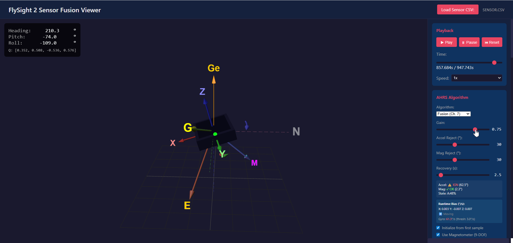
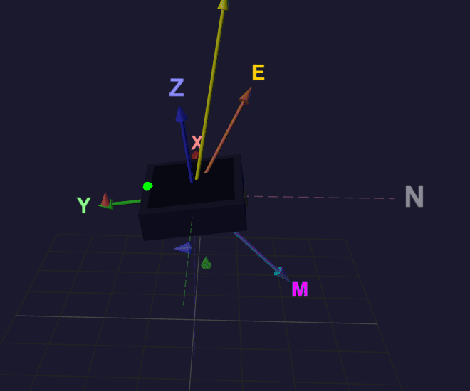
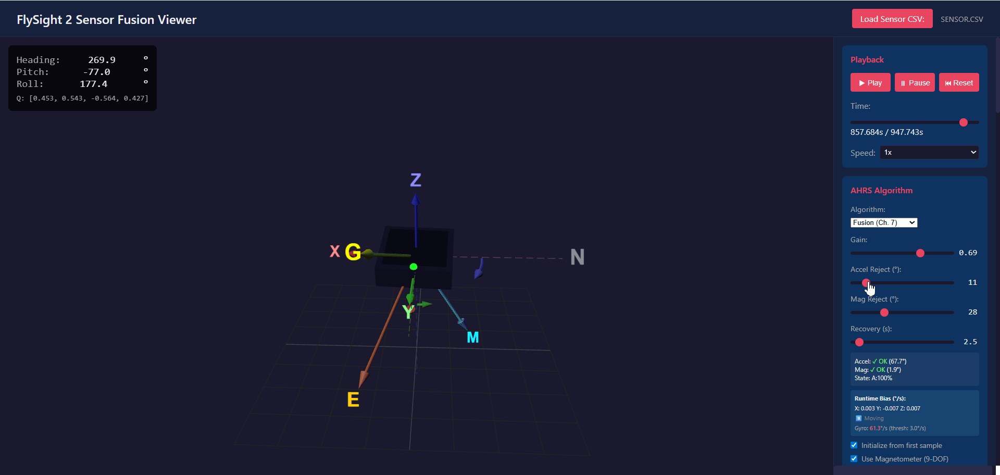
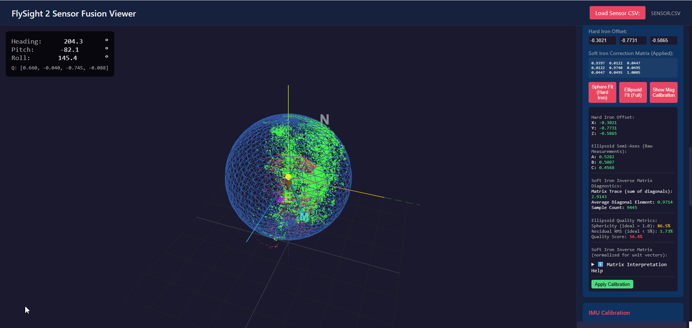
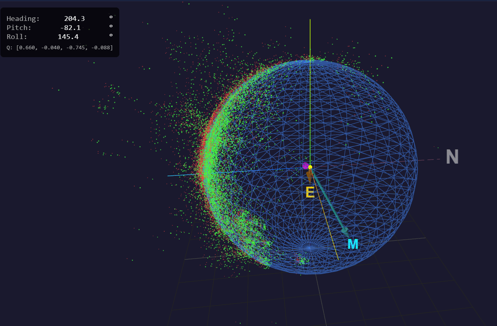
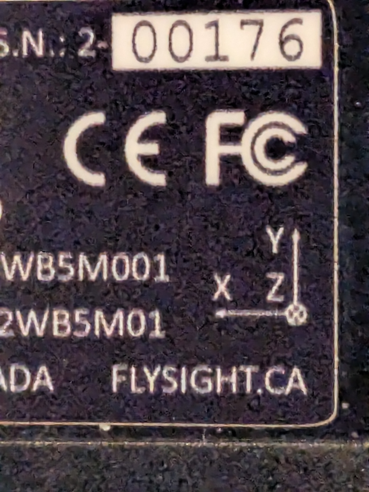
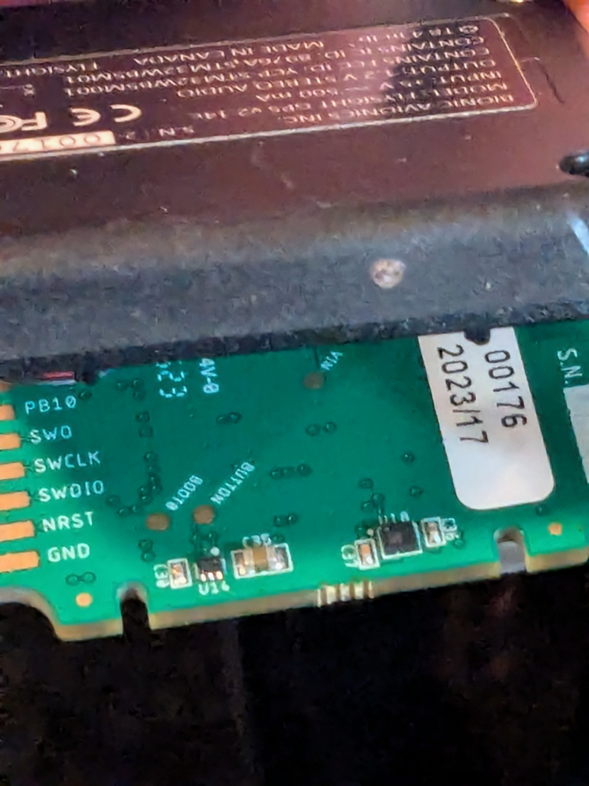
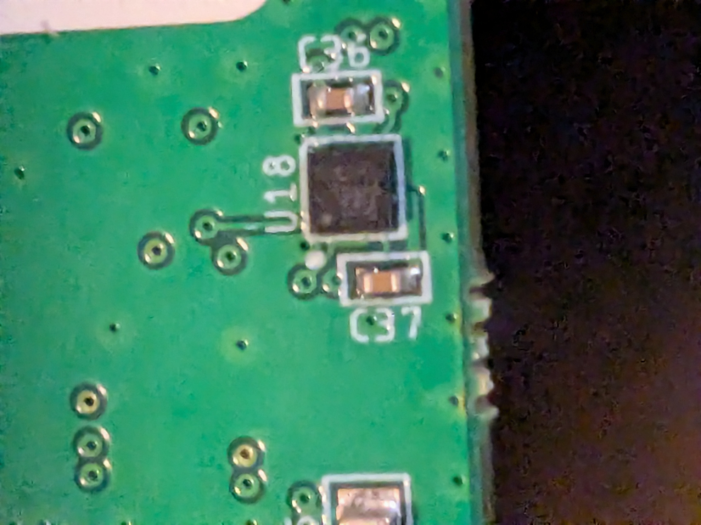
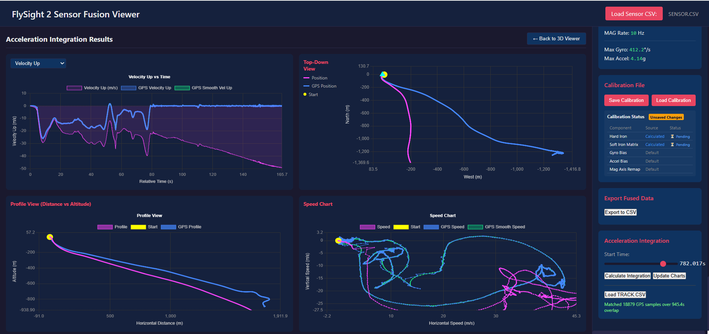

# FlySight 2 Sensor Fusion Viewer

**Post-processing sensor fusion for FlySight 2 GPS/IMU data — calibrate, tune, visualize, and validate orientation algorithms using real flight data.**


*Adjusting the gain (β) parameter — watch the orientation response change in real time*

---

## Why This Project Exists

Every sensor in a flying system measures in its own reference frame. To do anything useful — combine GPS with IMU, feed data into a Kalman filter, compare sensors across devices — you need to translate everything into a **shared global reference frame**. That's what sensor fusion does.

The Madgwick/Fusion AHRS algorithm is compact and powerful, but getting it to work correctly requires careful tuning of gain, rejection, and recovery parameters. The challenges aren't limited to extreme flight conditions — dissociation and recovery happen constantly during normal motion. Walking, driving, head movement, mild turbulence — the algorithm is always making decisions about when to trust its sensors and when to fall back on its own internal model. Getting the subtleties wrong produces garbage orientation — and there's no way to know without being able to **see** what the filter is doing.

This viewer lets you:
1. **Load real flight data** from FlySight 2 (SENSOR.CSV with interleaved IMU/MAG at 400Hz)
2. **Run the fusion algorithm in post** with adjustable parameters
3. **Visualize everything** — orientation, rejection decisions, magnetic vectors, acceleration vectors
4. **Iterate on calibration and settings** until the output is correct
5. **Export fused data** in a global reference frame for downstream filters

Once settings are validated in post-processing, they can be ported to real-time firmware (C implementation included).

---

## Table of Contents

- [Quick Start](#quick-start)
- [The Algorithm](#the-algorithm)
  - [Madgwick AHRS — The Core Idea](#madgwick-ahrs--the-core-idea)
  - [The Cross Product Correction](#the-cross-product-correction)
  - [Gain (β) — The Trust Dial](#gain-β--the-trust-dial)
  - [The Adaptive Problem](#the-adaptive-problem)
  - [Where Basic Madgwick Fails](#where-basic-madgwick-fails)
- [Dissociation and Recovery](#dissociation-and-recovery)
  - [Acceleration Dissociation](#acceleration-dissociation)
  - [Magnetic Dissociation](#magnetic-dissociation)
  - [Recovery — Forced Reconciliation](#recovery--forced-reconciliation)
  - [The Three-Way Tradeoff](#the-three-way-tradeoff)
  - [Gyroscope Bias Estimation](#gyroscope-bias-estimation)
- [Calibration](#calibration)
  - [Magnetometer Calibration (Hard Iron + Soft Iron)](#magnetometer-calibration)
  - [Accelerometer Calibration (6-Position)](#accelerometer-calibration)
  - [The Coordinate Transform Problem](#the-coordinate-transform-problem)
  - [FlySight 2 Hardware](#flysight-2-hardware)
- [Visualization Guide](#visualization-guide)
  - [3D Device Orientation](#3d-device-orientation)
  - [Dissociation Vectors](#dissociation-vectors)
  - [Magnetic Vector Display](#magnetic-vector-display)
  - [GPS Integration and Speed](#gps-integration-and-speed)
- [Filter Chaining — The Bigger Picture](#filter-chaining--the-bigger-picture)
- [Firmware Integration](#firmware-integration)
- [FlySight 2 Configuration](#flysight-2-configuration)
- [File Reference](#file-reference)
- [References](#references)

---

## Quick Start

```bash
npm install
npm run dev
# Open http://localhost:3000
```

1. Click **Load Sensor CSV** → select a FlySight 2 `SENSOR.CSV`
2. (Optional) Load matching `TRACK.CSV` for GPS overlay
3. Press **Play** to step through the data
4. Adjust **Beta**, **Rejection**, and **Calibration** sliders
5. Watch the 3D viewer and vector arrows respond in real time

---

## The Algorithm

> *"You take the blue pill, the story ends. You wake up in your bed and believe whatever you want to believe. You take the red pill, you stay in Wonderland, and I show you how deep the rabbit hole goes."*
> — Morpheus, *The Matrix*

The AHRS filter faces this choice at every sample: trust the sensors (red pill — face reality, however noisy) or trust the gyro's internal model (blue pill — smooth, comfortable, drifting from truth). Gain controls which pill it swallows. Dissociation is what happens when reality becomes too dangerous to face directly.

### Madgwick AHRS — The Core Idea

The filter maintains orientation as a **quaternion** and updates it at every IMU sample (~400 Hz):

```
q(t+1) = q(t) + q̇ · dt
```

where `q̇` blends two sources of orientation information:

1. **Gyroscope** — measures angular velocity directly. Integrating gyro data gives orientation changes, but errors accumulate over time (gyro bias and noise drift the estimate away from truth).

2. **Accelerometer + Magnetometer** — measure the direction of gravity and the Earth's magnetic field. These don't drift, but they're noisy and easily corrupted by motion (accelerometer) and nearby ferromagnetic materials (magnetometer).

The filter's job is to combine these: use the gyro for fast, smooth tracking of orientation changes, and use the accel/mag to correct the drift — but only when those sensors can be trusted.

### The Cross Product Correction

The correction step is often described as gradient descent, but the actual mechanism is a **cross product** — faster, more mechanical, and perfectly suited to this problem.

The idea: if the quaternion estimate is correct, then rotating the known Earth-frame reference vectors (gravity, magnetic field) into the sensor frame should match what the sensors actually read. When they don't match, the **cross product** between the expected vector and the measured vector gives:

- A **rotation axis** — perpendicular to both vectors, pointing along the direction the quaternion needs to rotate
- An **error magnitude** — proportional to the sine of the angle between them

```
error = expected × measured
```

This error is a direct, mechanical correction signal. No iteration, no cost function minimization — just "the expected vector is here, the measured vector is there, rotate this way to close the gap." The cross product gives you both the direction and the amount in a single operation.

The correction is then applied to the quaternion derivative, scaled by gain (β):

```
q̇ = q̇_gyro + β · q̇_correction
```

<!-- Cross product correction visualization — future GIF -->

### Gain (β) — The Trust Dial

β controls how much the filter trusts the accelerometer and magnetometer relative to the gyroscope. It's the single most important parameter.

```
q̇ = q̇_gyro + β · q̇_correction
         ↑              ↑
    always active    scaled by β
```

- **β = 0** → Pure gyro integration. No correction from accel/mag at all. The quaternion drifts immediately with no way to correct itself.
- **β low (0.01–0.1)** → Gyro-dominant. Corrections are too gentle to keep the quaternion tightly converged. The estimate is always slightly wrong, which causes problems downstream — the dissociation logic can't establish a clean baseline, so it hovers near threshold, constantly triggering and releasing.
- **β ≈ 0.5–1.0** → The working range for real motion (walking, head movement, flying). The quaternion converges aggressively and tracks the sensors tightly. When an actual disturbance hits, the error jumps cleanly above the dissociation threshold — sharp engagement, clean return. This is where the algorithm actually works as designed.
- **β very high (2+)** → Over-correction. The quaternion chases every sample of sensor noise. Orientation jitters.

The key insight: **β is not just a noise filter — it determines what the quaternion fundamentally represents.** At low β, the quaternion tracks the gyro's version of reality. At high β, it tracks the accelerometer/magnetometer's version. These are only the same thing when the sensor is in gentle, undisturbed motion.

**Why the commonly recommended values are wrong:** Most algorithm documentation suggests β ≈ 0.1 as a starting point. This may work for near-static applications (opening a laptop lid, slow rotations on a bench) but in practice it's far too low for any real-world motion. With β = 0.1, the quaternion never fully converges, the error against sensor measurements is always elevated, and the dissociation system can't distinguish "normal inaccuracy" from "actual disturbance." The filter lives in a gray zone where it's never quite right and never quite wrong.

**Recommended settings for normal motion (head-mounted sensor, walking, flying):**

| Parameter | Value | Notes |
|-----------|-------|-------|
| **β (gain)** | **0.7** | Tight convergence, clean dissociation |
| **Acceleration dissociation** | **25°** | High enough to avoid false triggers during normal motion |
| **Magnetic dissociation** | **25°** | Similar — tolerates minor field variations |
| **Recovery period** | **5 seconds** | Rarely needed when gain is correct |

At these settings, the quaternion is accurate enough during normal operation that dissociation thresholds work as intended — they fire on real disturbances, not on accumulated estimation error. Recovery is a safety net that almost never activates because the tight convergence means the quaternion re-acquires truth naturally when the disturbance passes.

| β | Behavior | Use Case |
|---|----------|----------|
| **0** | Pure gyro, drifts immediately | Never use |
| **0.01–0.1** | Under-converged, dissociation unreliable | Problematic — common in documentation but doesn't work in practice |
| **0.5–1.0** | Tight convergence, clean dissociation | **Real-world motion — recommended** |
| **2+** | Over-corrected, jittery | Too aggressive |


*Low gain (left) vs correctly tuned gain — the quaternion convergence is visibly different*

### The Adaptive Problem

Even with gain dialed in (β ≈ 0.7), there are scenarios that push the boundaries:

**During a fast spin** — at very high angular rates, the gyro is the only sensor that can track the rotation. The accel/mag corrections at high gain might fight the spin dynamics. The dissociation system handles this automatically — the accelerometer reads centripetal forces, exceeds the 25° threshold, and the filter dissociates cleanly. The high gain actually helps here: when the spin stops, the quaternion re-acquires truth immediately because the gain is high enough to converge before significant drift accumulates.

**In normal motion** — walking, driving, flying — the algorithm is constantly making micro-decisions about sensor trust. Dissociation flickers on and off during brief accelerations, corrections happen in the gaps. Watching the rejection vectors in the viewer, you'll see this constant negotiation. The algorithm works, but not always in the clean on/off way the theory describes — it's more of a continuous conversation between the filter and its sensors.

**Low sample rate** — this is where things get dangerous regardless of gain. With wide gaps between samples, the gyro integration is coarse and the correction has fewer opportunities to act. The FlySight's 400 Hz IMU rate avoids this problem, but it's a real concern when working with lower-rate sensors.

**Low gain + low sample rate** — the worst combination. The corrections are too weak (low β) and too infrequent (low rate) to track any dynamic motion. The filter gets lost in any sort of bumpy or dynamic situation and may never recover.

The bottom line: **start with high gain, and let the dissociation system handle the exceptions.** The dissociation thresholds are your primary tool for managing dynamic environments, not the gain. Gain controls convergence quality; dissociation controls sensor trust.

### Where Basic Madgwick Fails

> *"You always fear what you don't understand."*
> — Carmine Falcone, *Batman Begins*

The basic Madgwick algorithm uses a fixed β with no awareness of sensor validity. It doesn't understand that its inputs can be poisoned. In practice, this breaks in two specific ways:

**1. Accelerometer doesn't always measure gravity**

During any acceleration — turning a corner, braking, tilting, a gust of wind — the accelerometer reads gravity plus whatever other forces are acting. The cross product correction sees a discrepancy between expected gravity and measured acceleration and rotates the quaternion toward the wrong answer.

This isn't limited to extreme maneuvers. Even walking produces accelerations that corrupt the gravity estimate. Freefall is conceptually dramatic (the accelerometer reads ~0g), but in practice the gravity vector only disappears for a second or two at most, and normal flight accelerations aren't dramatically different from what you'd experience driving a car. The issue is that *any* dynamics cause corruption — it's a matter of degree, not a threshold.


*Acceleration and magnetic rejection vectors during dynamic flight — the filter decides moment by moment which sensors to trust*

**2. Magnetic field distorted by environment**

Inside an aircraft, near a helmet camera, or near any ferromagnetic material, the local magnetic field doesn't point north. The filter's heading correction drives the quaternion toward the distortion.

This is insidious because it looks almost correct — pitch and roll are fine (accelerometer is working), but heading slowly rotates to track the distortion. Remove the disturbance and the heading may not come back, depending on gain settings.

<!-- Magnetic distortion visualization — future GIF -->

---

## Dissociation and Recovery

> *"Would you like to see my mask? I use it in my experiments."*
> — Dr. Jonathan Crane, *Batman Begins*

When the sensor environment goes toxic — high-G maneuvers, magnetic disturbances, freefall — the filter's inputs become poisoned. Like Scarecrow's fear toxin, the corruption doesn't announce itself. The data still arrives, still looks like numbers, still flows through the algorithm. But the reality it describes has become a hallucination imposed by the environment.

The x-io Fusion algorithm (Chapter 7 of Madgwick's PhD thesis, ported in `FusionAhrs.ts`) solves this with a mechanism that's commonly called "rejection" — but **dissociation** is a more accurate description of what actually happens.

The filter doesn't simply go "gyro only" when it detects bad sensor data. Instead, it **hallucinates its own reference vectors** from the current quaternion estimate and uses those in place of the real sensor measurements. The full correction algorithm keeps running — cross product, gain, everything — but against the filter's own internal model of reality rather than actual sensor data.

This is a critical distinction: the filter is never blind. During dissociation, it's running a complete, self-consistent update loop. It's just disconnected from external truth.

### Acceleration Dissociation

**Trigger:** The angle between the measured accelerometer vector and the quaternion's predicted gravity direction exceeds the rejection threshold.

```
expected_gravity = rotate([0, 0, -1], quaternion)    // What gravity should look like
measured_accel   = [ax, ay, az]                       // What the sensor actually reads
error_angle      = angle_between(expected_gravity, measured_accel)

if error_angle > threshold:
    // DISSOCIATE: substitute hallucinated gravity for real measurement
    use expected_gravity instead of measured_accel in correction step
```

When dissociated, the filter generates its own acceleration reference from the quaternion — "if my orientation estimate is correct, gravity points *this* way" — and feeds that back into the cross product correction. The correction error drops to zero because the filter is comparing its estimate against... its own estimate.

The result: the quaternion evolves on gyro integration alone (corrections are self-canceling), but the algorithm structure is unchanged. No special "gyro only" code path.

**Settings:**
- `accelerationRejection`: Threshold in degrees (recommended: **10°**)
- Engages during maneuvers, freefall, turbulence — any time the accelerometer doesn't agree with the quaternion's model of gravity


*Acceleration rejection threshold in action — the filter dissociates during dynamic motion and re-acquires when conditions improve*

### Magnetic Dissociation

Same principle, applied to heading. When the measured magnetic field direction disagrees with the quaternion's prediction of where the field should point:

```
expected_mag = rotate(earth_magnetic_field, quaternion)
measured_mag = [mx, my, mz]
heading_error = angle_between(expected_mag, measured_mag)

if heading_error > threshold:
    // DISSOCIATE: hallucinate magnetic reference from quaternion
    use expected_mag instead of measured_mag
```

The filter disconnects from the magnetometer and hallucinates its own magnetic reference. Heading is maintained by gyro integration alone, with the self-referencing correction keeping the algorithm mathematically stable.

**Settings:**
- `magneticRejection`: Threshold in degrees (recommended: **10°**)
- Only affects heading (yaw), not tilt (pitch/roll)

<!-- Magnetic dissociation visualization — future GIF -->

### Recovery — Forced Reconciliation

> *"The training is nothing! The will is everything! The will to act!"*
> — Henri Ducard, *Batman Begins*

Dissociation solves the corruption problem but creates a new one: **drift**. During dissociation, the quaternion runs on gyro integration with no external correction. Gyro bias and integration error slowly pull the estimate away from truth. The longer the dissociation, the larger the accumulated error — and the filter has no way to detect this because it's only checking against its own hallucinated references.

Recovery is the circuit breaker. It works similarly to the startup algorithm:

**At startup**, the quaternion is unknown. The filter must trust the raw sensor data — accelerometer for tilt, magnetometer for heading — and build the quaternion from scratch. High effective gain forces rapid convergence from sensor reality.

**During recovery**, the same thing happens. After prolonged dissociation, the filter is forced to **snap back to reality**: the hallucinated references are discarded, the actual sensor measurements are used directly, and the effective gain is temporarily elevated to force the quaternion to reconcile with truth.

```
if dissociation_duration > recovery_trigger_period:
    // RECONCILE: dispel hallucinations, re-trust sensors
    force high gain
    use actual sensor measurements (not hallucinated references)
    quaternion snaps back toward sensor-derived orientation
```

This can be thought of as the filter admitting: "I've been hallucinating for too long. My internal model has probably drifted. Time to face reality and fix whatever errors have accumulated." Like Lucius Fox's antidote to Scarecrow's fear toxin — recovery dispels the hallucination and forces the system back to ground truth.

**The recovery trigger period** controls when this happens:
- **Too short** → filter reconciles before the disturbance is over → corruption from bad sensor data
- **Too long** → gyro drift accumulates during dissociation → large snap when recovery fires
- **Right** → recovery fires after the disturbance passes but before drift becomes significant

<!-- Recovery timing visualization — future GIF -->

### The Three-Way Tradeoff

Gain (β), dissociation thresholds, and recovery timing form an interconnected system — but with gain set correctly (β ≈ 7), the system is far less sensitive to the other parameters:

```
                    ┌─────────────────┐
                    │  Gain (β ≈ 0.7) │
                    │                 │
                    │  Tight quat     │
                    │  convergence    │
                    └────────┬────────┘
                             │
              ┌──────────────┼──────────────┐
              ↓              │              ↓
    ┌─────────────────┐      │    ┌─────────────────────┐
    │   Dissociation  │      │    │     Recovery         │
    │   ~25°          │      │    │     ~5 seconds       │
    │                 │      │    │                       │
    │  Clean trigger  │      │    │  Safety net only —   │
    │  on real        │      │    │  rarely fires when   │
    │  disturbances   │      │    │  gain is correct     │
    └─────────────────┘      │    └─────────────────────┘
                             │
                    ┌────────┴────────┐
                    │   Key insight   │
                    │                 │
                    │ Get gain right  │
                    │ first.          │
                    │ Everything else │
                    │ follows.        │
                    └─────────────────┘
```

When gain is too low, you end up constantly adjusting dissociation thresholds and recovery timing to compensate — chasing a moving target. When gain is correct (β ≈ 0.5–1.0), the dissociation thresholds are straightforward (25° works broadly), and recovery is insurance you rarely need.

There is no theoretical way to validate these settings without seeing them in action. That's why this viewer exists — you load real flight data, adjust the parameters, and **watch** the filter handle (or fail to handle) the actual conditions your sensor will face.

### Gyroscope Bias Estimation

The filter automatically detects stationary periods (angular rate < 3°/s across all axes) and estimates the gyroscope bias offset. This compensates for temperature drift and manufacturing imperfections that cause the gyro to read a small non-zero rate even when stationary.

The bias estimate is subtracted from the raw gyro readings before integration. This is particularly important during prolonged dissociation, where gyro bias is the primary source of quaternion drift.

---

## Calibration

> *"I can see the B field"*
> — Hartman

Raw magnetometer data is not always what you would expect. Without calibration, the numbers arrive — confident, continuous, completely wrong. The filter will happily build an orientation from them, and the orientation will be garbage.

### Why Magnetometer Calibration Matters Most

The accelerometer and gyroscope on the FlySight 2 (LSM6DSO) come well-calibrated from the factory. The gyro may have a tiny bias offset, but the filter's bias estimation handles that automatically. The accelerometer is naturally noisy but accurate — no significant calibration errors in practice.

The magnetometer is a completely different situation.

An uncalibrated magnetometer doesn't just have small errors — it can point in **any direction**. A 180° physical rotation that should reverse the magnetic vector might instead just shorten it and leave it pointing roughly the same way. This is because the dominant error source — hard iron distortion — adds a constant offset vector to every measurement, which can overwhelm the actual Earth field signal.

The difference in severity:
- **Gyro bias**: off by a fraction of a degree per second. Filter compensates automatically.
- **Accelerometer error**: noisy but centered. Cross product correction averages it out.
- **Magnetometer uncalibrated**: the heading vector could be pointing anywhere. The fusion algorithm will confidently track a completely wrong heading.

### Hard Iron — The Dominant Problem

Hard iron distortion comes from **conductive materials channeling the ambient magnetic field**. Metal components in and around the device — the circuit board traces, battery housing, GPS antenna ground plane, mounting hardware — act as conduits that redirect the local magnetic field, creating a constant offset in every magnetometer reading regardless of orientation.

This is *not* the device generating its own magnetic field. Changing voltages, RF emissions, high-frequency electronics — none of these produce detectable effects on the magnetic vector in practice. What matters is the physical geometry of conductive material near the sensor, which channels and distorts the Earth's ambient field passing through it.

In 3D scatter plots of raw mag data, hard iron shows up as the measurement sphere shifted off-center. A perfectly calibrated magnetometer tumbled through all orientations would produce readings on a sphere centered at the origin. Hard iron shifts the center of that sphere.

**This is the biggest calibration problem in practice.** The FlySight's own metal and conductive components are the primary source of distortion — not the electronics, not RF, and (in normal flight) not the external environment.

**Critical implication: hard iron calibration is location-dependent.** Because the distortion comes from channeling the *ambient* magnetic field, the same device calibrated in two different locations can produce different hard iron offsets. The local magnetic environment (proximity to buildings, geological features, latitude) changes the ambient field being channeled. The sensor and its surrounding metal are identical — but the field they're channeling is different. This means a calibration performed indoors near steel-framed walls may not be valid outdoors, and a calibration in one geographic region may drift slightly in another.


*Magnetometer calibration: raw data forms an offset ellipsoid → ellipsoid fit corrects hard/soft iron → centered sphere*

**Procedure:**
1. Load a CSV containing a magnetometer calibration tumble (60–90 seconds, covering all orientations)
2. Click **Calculate Ellipsoid** — fits hard iron offsets (sphere center) + soft iron corrections (sphere distortion)
3. Apply calibration and verify the scatter plot forms a centered sphere
4. Save calibration JSON for reuse

### Soft Iron — Subtle and Usually Negligible

Soft iron distortion comes from nearby conductive materials that channel the magnetic field directionally. Instead of shifting the sphere, it stretches it into an ellipsoid — the measured field magnitude depends on which direction the sensor is pointing.

In practice, **soft iron effects have not been significant** for FlySight applications. The ellipsoid fit handles them mathematically (it's part of the same calibration), but the corrections are small. If you're working with real-time adaptive filtering or in environments with large nearby conductive structures, soft iron might matter more — but for post-processing flight data with a well-characterized device, hard iron dominance means getting the offset right is what matters.

### Accelerometer Calibration (6-Position)

Places the device in 6 known orientations (+X up, −X up, +Y up, −Y up, +Z up, −Z up) to solve for:
- Scale factor error per axis
- Cross-axis coupling
- Zero-g offset


*6-position accelerometer calibration — the device is held in each orientation while the viewer records and fits*

### The Coordinate Transform Problem

The FlySight 2 has the IMU (LSM6DSO) on the **front** of the PCB and the magnetometer (LIS2MDL) on the **back**. This means the magnetometer axes are **mirrored**:

```c
mag_device_x = -mag_raw_x;  // X inverted (PCB flip)
mag_device_y =  mag_raw_y;  // Y unchanged
mag_device_z = -mag_raw_z;  // Z inverted (PCB flip)
```

Getting this wrong produces heading errors that look almost-but-not-quite right — the most insidious kind of bug. The heading might track correctly in some orientations and be 180° off in others.

#### FlySight 2 Hardware

**PCB Front** — GPS module (u-blox NEO-M9N), IMU (LSM6DSO), coordinate system silkscreen:


**PCB Front (bottom angle)** — debug header, serial number:


**PCB Back** — magnetometer (LIS2MDL) side:



**Magnetometer close-up** — U18 (LIS2MDL) with Y-axis indicator:



**Magnetometer detail** — LIS2MDL chip and surrounding capacitors:



The magnetometer is on the **opposite side** of the PCB from the IMU — this is why the X and Z axes are negated. The Y axis (perpendicular to the board) is shared.

See [COORDINATE_SYSTEMS.md](COORDINATE_SYSTEMS.md) for the full derivation with PCB layout photos and verification tests.

---

## Visualization Guide

### 3D Device Orientation

The viewer renders a FlySight 2 model with the fused orientation quaternion applied in real time. The device model rotates to match the estimated orientation at each timestep during playback.

### Dissociation Vectors

The viewer displays **dissociation state vectors** that show when and why the filter has disconnected from sensor reality:

- **Acceleration dissociation arrow** — appears when the filter is hallucinating its own gravity reference (high-G, freefall, turbulence)
- **Magnetic dissociation arrow** — appears when the filter is hallucinating its own magnetic reference (magnetic disturbance)


*Dissociation vectors during a wingsuit BASE exit — showing exactly when the filter disconnects from each sensor*

These make it immediately obvious **when** the filter is dissociated and **which sensor** it's ignoring. During tuning, you want to see dissociation engage precisely during disturbances and disengage cleanly when conditions improve.

### Magnetic Vector Display

The magnetic field vector is displayed as an arrow, showing the measured field direction in real time. During magnetic disturbances, you can **see** the vector deflect away from the expected Earth field direction.


*Magnetic field vector during dynamic flight — obvious deflections show when the algorithm needs dissociation*

This is the single most useful diagnostic for understanding magnetic environment issues. You can see exactly when, how much, and in what direction the field is being corrupted — and whether the filter's dissociation threshold is set correctly to catch it.

### GPS Integration and Speed

When a matching `TRACK.CSV` (GPS data) is loaded alongside the sensor data:
- Speed chart shows GPS-derived and SG-filtered velocity curves
- Time synchronization between GPS (5 Hz) and IMU (400 Hz) data streams
- Acceleration comparison: GPS-derived vs. sensor-measured (global frame)


*GPS track loaded and synchronized with sensor data — speed and position overlay*

---

## Filter Chaining — The Bigger Picture

> *"We monitor many frequencies. We listen always. Came a voice, out of the babel of tongues, speaking to us. It played us a mighty dub."*
> — William Gibson, *Neuromancer*

This project is one stage in a larger sensor data pipeline:

```
┌─────────────┐     ┌──────────────────┐     ┌────────────────┐     ┌───────────────┐
│ Raw Sensors │ ──→ │ Calibration +    │ ──→ │ AHRS Fusion    │ ──→ │ Downstream    │
│ IMU 400Hz   │     │ Coordinate       │     │ (this project) │     │ Filters       │
│ MAG 100Hz   │     │ Transform        │     │                │     │               │
│ GPS 5Hz     │     │                  │     │ Quaternion →   │     │ • GPS Kalman  │
└─────────────┘     └──────────────────┘     │ Global frame   │     │ • Aero state  │
                                             │ orientation    │     │ • VR headset  │
                                             └────────────────┘     └───────────────┘
```

### Why Global Reference Frame Matters

Once sensor data is in a global reference frame (NED or ENU), it can be:

- **Combined with GPS** — accelerometer data in Earth frame gives body-relative forces for aerodynamic analysis
- **Fed into a Kalman filter** — GPS position/velocity + IMU-derived attitude = full 6DOF state estimation
- **Used for VR calibration** — real-time heading from Bluetooth IMU data aligns the virtual world to the physical one
- **Shared across devices** — multiple sensors on a single flying system (helmet, wingsuit, altimeter) can all report in the same frame

### Multi-Sensor Vision

In a system with multiple FlySight units or other IMU-equipped sensors, each device runs its own AHRS filter to produce orientation in the global frame. The settings validated in this viewer — calibration, gain, dissociation thresholds — transfer directly to the real-time firmware running on each device.

A central flight controller or post-processing pipeline then fuses the global-frame data from all sources. The AHRS on each sensor is the first link in this chain — if it's wrong, everything downstream inherits the error.

### Connections to Other Projects

| Project | Relationship |
|---------|-------------|
| **CloudBASE** | GPS Kalman filter consumes global-frame IMU data for state estimation |
| **Polar Project** | Aerodynamic model validation uses fused orientation + GPS-derived aero states |
| **BASEline** | Flight data analysis benefits from IMU-derived attitude during GPS gaps |
| **VR Headset** | Real-time Bluetooth heading from AHRS calibrated with this tool |

---

## Firmware Integration

The `firmware/` folder contains C code ready for STM32 integration:

```c
#include "fusion.h"

FusionConfig config = {
    .beta = 0.1f,
    .apply_mag_transform = true
};
Fusion_Init(&config);

// In IMU callback (~400 Hz):
Fusion_UpdateIMU(dt, gx, gy, gz, ax, ay, az);

// In MAG callback (~100 Hz):
Fusion_UpdateMag(mx, my, mz);

// Get orientation:
FusionOutput output;
Fusion_GetOutput(&output);  // .quaternion, .euler, .heading
```

### Algorithm Options

| Algorithm | File | Features | Status |
|-----------|------|----------|--------|
| **Madgwick (basic)** | `fusion.ts` / `fusion.c` | Single β gain, cross product correction | ✅ Working |
| **x-io Fusion (Ch.7)** | `FusionAhrs.ts` | Dissociation, recovery, bias estimation | ✅ Ported, validated |
| **ST Micro generic** | — | Hardware-optimized for LSM6DSO | ⬜ Under evaluation |

The x-io Fusion algorithm is the current recommendation. If ST Micro's proprietary algorithm proves better for the LSM6DSO specifically, it may replace the firmware implementation — but this viewer's visualization and calibration tools remain valuable regardless of which algorithm runs on-device.

---

## FlySight 2 Configuration

### Required Firmware Version

**FlySight firmware v2024.12.30** — the only version confirmed to support high-speed sensor data logging correctly.

### Sensor ODR Settings (`CONFIG.TXT`)

```ini
; Magnetometer - 100 Hz
Mag_ODR: 3

; Accelerometer - 416 Hz
Accel_ODR: 6

; Gyroscope - 416 Hz (matches accel for sync)
Gyro_ODR: 6
```

### Sensor Units

| Sensor | Rate | Units | Notes |
|--------|------|-------|-------|
| Gyroscope | ~400 Hz | deg/s (→ rad/s internally) | 2000 dps range |
| Accelerometer | ~400 Hz | g | ±16g range |
| Magnetometer | ~100 Hz | gauss | Interleaved in CSV |

---

## File Reference

### Web Application (`fusion_viewer/src/`)

| File | Description |
|------|-------------|
| `main.ts` | Entry point, event wiring |
| `fusion.ts` | Basic Madgwick AHRS (TypeScript) |
| `FusionAhrs.ts` | x-io Fusion Ch.7 AHRS — dissociation, recovery, bias |
| `FusionAhrsAdapter.ts` | Coordinate transform adapter (device → NWU) |
| `FusionBias.ts` | Gyroscope bias estimation module |
| `csvParser.ts` | FlySight SENSOR.CSV parser (interleaved IMU/MAG) |
| `viewer.ts` | Three.js 3D orientation viewer |
| `shadedArrow.ts` | Gradient-shaded force/vector arrows |
| `curvedArrow.ts` | Curved moment arrows |
| `ellipsoidFit.ts` | Ellipsoid fitting for soft iron calibration |
| `magCalibration.ts` | Magnetometer calibration pipeline |
| `accelCalibration6Pos.ts` | 6-position accelerometer calibration |
| `imuCalibration.ts` | IMU calibration utilities |
| `calibrationManager.ts` | Calibration UI orchestration |
| `calibrationExecutive.ts` | Guided calibration workflow |
| `calibrationFile.ts` | Calibration save/load (JSON) |
| `sgFilter.ts` | Savitzky-Golay smoothing filter |
| `sgCoefficients.ts` | Pre-computed SG filter coefficients |
| `gpsIntegration.ts` | GPS TRACK.CSV loading + time sync |
| `gpsCharts.ts` | GPS speed/altitude charts |
| `accelerationIntegration.ts` | Accel → velocity → position integration |
| `integrationCharts.ts` | Integration result charts |
| `fusedDataExport.ts` | Export fused orientation data |
| `appState.ts` | Shared application state |
| `playbackController.ts` | Playback, seeking, speed control |
| `timestampSync.ts` | IMU/MAG/GPS timestamp alignment |
| `constants.ts` | Shared constants |
| `types.ts` | TypeScript type definitions |
| `mathUtils.ts` | Vector/quaternion math utilities |

### Firmware (`fusion_viewer/firmware/`)

| File | Description |
|------|-------------|
| `fusion.h` | C header for STM32 integration |
| `fusion.c` | Portable C implementation (no malloc) |

### Documentation

| File | Description |
|------|-------------|
| `ALGORITHM_RESEARCH.md` | Algorithm comparison and research notes |
| `COORDINATE_SYSTEMS.md` | PCB layout, axis transforms, verification tests |
| `quest/PORTING_GUIDE.md` | Notes on porting to Quest VR platform |

### Data Files

| File | Description |
|------|-------------|
| `*.CSV` | Sample FlySight sensor data files |
| `*.json` | Saved calibration configurations |

---

## References

- [Madgwick PhD Thesis](https://x-io.co.uk/downloads/madgwick-phd-thesis.pdf) — Chapter 7 is the improved algorithm with dissociation and recovery
- [x-io Fusion Library (C)](https://github.com/xioTechnologies/Fusion) — Reference implementation
- [Original Madgwick Paper (2011)](https://x-io.co.uk/res/doc/madgwick_internal_report.pdf) — Basic algorithm
- [LSM6DSO Datasheet](https://www.st.com/resource/en/datasheet/lsm6dso.pdf) — IMU (accel + gyro)
- [LIS2MDL Datasheet](https://www.st.com/resource/en/datasheet/lis2mdl.pdf) — Magnetometer

---

*Built for the FlySight 2 community. Validated with real skydiving, wingsuit, and speed flying data.*
